Behavioral data analysis (Flanker Task)
================

# Introduction

The following project was the analysis of behavioral data collected
during a flanker task. Participants performed this flanker task for
about 40 minutes whilst also having a electroencephalogram recorded of
their surficial cerebral activity. The behavioral data included a
response time which was recorded from stimulus onset to keypress, the
correctness of the answer, the number of the trial as a representation
of time-on-task and the flanker task related condition (congruent or
incongruent stimuli). <br> Analysis of the behavioral data was targeted
to find a relationship between time-on-task and the reaction time - it
was assumed that with increasing time-on-task the reaction time would
also increase. This phenomenon was expected due to an effect called
vigilance decrement. Before examination of the relationship the data had
to be cleaned according to previously determined criteria. The
examination was then performed on an individual level and a group level.
Lastly, exploratory analyses were added. <br> <i>Please note: the titles
and axis titles of graphs are written in German since the work was
written in German.</i>

# Import required packages

``` r
rm(list=ls(all=T))
library(dplyr)
library(ggplot2)
library(zoo);
```

# Read data

The data import and data reading is handled in a separate script.

``` r
source('data_import.R')
```

# Data preparation

## Apply within-person exclusion criteria

The within-person exclusion criteria was: <br>
<ul>
<li>
lower threshold: \< 100 ms (assumption: minimum time needed for
information processing) <br>
</li>
<li>
higher threshold: $$mean(RT) + 2*SD(RT)$$
</li>
</ul>

``` r
data_cleaned <- data %>%
  filter(!is.na(key_resp_trial.rt)) %>%  # remove rows that lack reaction times (RTs)
  group_by(id) %>% # group by person
  mutate(rt.thresh_low = 0.1) %>%  # create lower threshold for RTs
  mutate(rt.thresh_upper = (mean(key_resp_trial.rt) + 2.5*sd(key_resp_trial.rt))) %>% # create upper threshold for RTs
  rowwise() %>% 
  filter(key_resp_trial.rt > rt.thresh_low & key_resp_trial.rt < rt.thresh_upper) # check thresholds for every row (--> within person) and only keep rows not exceeding the thresholds
```

visual inspection whether it made sense to keep all participants
depending on the number of trials they had left:

``` r
trl_viewer <- data_cleaned %>% 
  group_by(id) %>% 
  summarise(first_trlNr = min(trials.thisN),
            last_trlNr = max(trials.thisN),
            total_trlNr = length(trials.thisN))
trl_viewer
```

    ## # A tibble: 21 × 4
    ##       id first_trlNr last_trlNr total_trlNr
    ##    <dbl>       <dbl>      <dbl>       <int>
    ##  1     1           0        959         951
    ##  2     2           0        959         946
    ##  3     3           0        959         938
    ##  4     4           0        959         947
    ##  5     5           0        959         945
    ##  6     6           0        959         942
    ##  7     7           0        959         940
    ##  8     8           0        959         947
    ##  9     9           0        959         944
    ## 10    10           0        959         940
    ## # … with 11 more rows

``` r
range(trl_viewer$total_trlNr)
```

    ## [1] 889 951

The left trials ranged from 889 to 951 which was seen as a sufficient
number of trials for every person.

## Check requirements

The normality requirement was checked to decide whether non-parametrical
testing would be more suitable. Even though the requirement was not met
it was decided that parametrical testing would be appropriate due to the
large sample.

``` r
normality_check <- data_cleaned %>% 
  group_by(id) %>% 
  summarise(statistic_RT = shapiro.test(key_resp_trial.rt)$statistic, 
            p.value_RT = shapiro.test(key_resp_trial.rt)$p.value,
            statistic_trlN = shapiro.test(trials.thisN)$statistic,
            p.value_trlN = shapiro.test(trials.thisN)$p.value) # create table with statistics and p-value of Shapiro-Wilk test of normality of desired variables

normality_check
```

    ## # A tibble: 21 × 5
    ##       id statistic_RT p.value_RT statistic_trlN p.value_trlN
    ##    <dbl>        <dbl>      <dbl>          <dbl>        <dbl>
    ##  1     1        0.993   1.30e- 4          0.955     1.51e-16
    ##  2     2        0.991   2.03e- 5          0.956     2.50e-16
    ##  3     3        0.979   2.68e-10          0.955     2.21e-16
    ##  4     4        0.993   1.59e- 4          0.955     1.58e-16
    ##  5     5        0.987   3.23e- 7          0.955     1.76e-16
    ##  6     6        0.982   1.97e- 9          0.956     2.92e-16
    ##  7     7        0.996   8.58e- 3          0.956     3.37e-16
    ##  8     8        0.995   5.53e- 3          0.956     2.62e-16
    ##  9     9        0.974   6.16e-12          0.955     2.50e-16
    ## 10    10        0.984   1.07e- 8          0.954     1.16e-16
    ## # … with 11 more rows

``` r
# the normality requirement is not met
# however the N is high
```

## Visualize data

To gain a first impression of the data the relevant variables were
plotted. <br>

Scatterplot of trial number (x) and reaction time (y) for each
participant:

``` r
raw_plot_fac <- ggplot(data_cleaned, aes(x = trials.thisN, 
                                   y = key_resp_trial.rt*1000)) +
  geom_point(shape = 1) +
  facet_wrap(~id) +
  theme(legend.position = "none",
        panel.background = element_rect(colour="black", fill="white"),
        strip.background = element_rect(colour="white", fill="white"),
        axis.title = element_text(size = 12),
        panel.spacing.x = unit(0,"line"), 
        panel.spacing.y = unit(0,"line")
        ) +
  scale_x_continuous(expand=c(0,0)) +
  geom_vline(xintercept=0) +
  xlab("Trialnummer") + # "trial number"
  ylab("Reaktionszeit in ms") #  "reaction time in ms"

raw_plot_fac
```

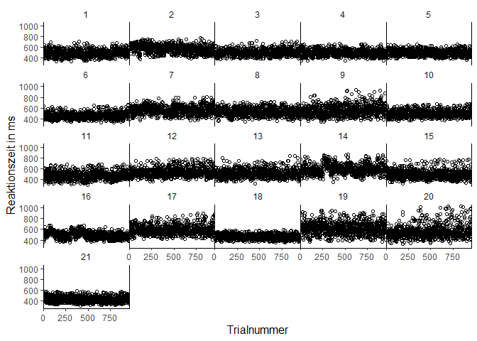<!-- -->

Scatterplot of trial number (x) and reaction time (y) for all
participants:

``` r
raw_plot_all <- ggplot(data_cleaned, aes(x = trials.thisN, 
                                   y = key_resp_trial.rt*1000)) +
  geom_point(shape = 1) +
  xlab("Trialnummer") + # "trial number"
  ylab("Reaktionszeit in ms") + # "reaction time in seconds"
  scale_x_continuous(expand=c(0,0)) +
  geom_vline(xintercept=0) +
  theme_classic()

raw_plot_all
```

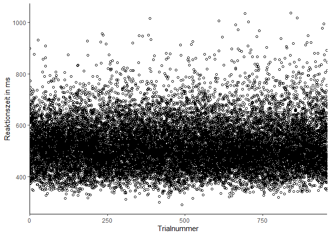<!-- -->

``` r
# first visual impression: no linear relationship apparant
```

From the first impression the reaction times did not seem to increase
over the course of the flanker task.

# First level analysis

## Pearson’s <i>r</i> for RT and trial number

``` r
corr_dat_pears <- data_cleaned %>% # create table for statistic, p-value and rank correlation (rho) with values for each participant
  group_by(id) %>% 
  summarise(statistic_corr = cor.test(key_resp_trial.rt, trials.thisN, method = 'pearson')$statistic,
            p.value_corr = cor.test(key_resp_trial.rt, trials.thisN, method = 'pearson')$p.value,
            r_corr = cor.test(key_resp_trial.rt, trials.thisN, method = 'pearson')$estimate)

corr_dat_pears
```

    ## # A tibble: 21 × 4
    ##       id statistic_corr p.value_corr  r_corr
    ##    <dbl>          <dbl>        <dbl>   <dbl>
    ##  1     1          0.844     3.99e- 1  0.0274
    ##  2     2         -8.55      4.93e-17 -0.268 
    ##  3     3          3.20      1.41e- 3  0.104 
    ##  4     4         -4.52      6.99e- 6 -0.145 
    ##  5     5         -4.25      2.35e- 5 -0.137 
    ##  6     6          2.82      4.86e- 3  0.0917
    ##  7     7          0.366     7.15e- 1  0.0119
    ##  8     8         -2.00      4.62e- 2 -0.0648
    ##  9     9          5.47      5.66e- 8  0.176 
    ## 10    10          0.657     5.11e- 1  0.0214
    ## # … with 11 more rows

# Second level analysis

Procedure:
<ol>
<li>
transform <i>r</i>-values into <i>z</i>-values
</li>
(Fisher transformation)
<ul>
<li>
formula: $$\frac{1}{2}ln(\frac{1 + r }{ 1 - r})$$
</li>
</ul>
<li>

one sample <i>t</i>-Test (not equal to 0)

``` r
corr_dat_pears <- corr_dat_pears %>%
  arrange(id) %>% 
  rowwise %>% 
  mutate(r.z = 0.5*log((1 + r_corr) / (1 - r_corr)))
corr_dat_pears
```

    ## # A tibble: 21 × 5
    ## # Rowwise: 
    ##       id statistic_corr p.value_corr  r_corr     r.z
    ##    <dbl>          <dbl>        <dbl>   <dbl>   <dbl>
    ##  1     1          0.844     3.99e- 1  0.0274  0.0274
    ##  2     2         -8.55      4.93e-17 -0.268  -0.275 
    ##  3     3          3.20      1.41e- 3  0.104   0.104 
    ##  4     4         -4.52      6.99e- 6 -0.145  -0.146 
    ##  5     5         -4.25      2.35e- 5 -0.137  -0.138 
    ##  6     6          2.82      4.86e- 3  0.0917  0.0919
    ##  7     7          0.366     7.15e- 1  0.0119  0.0119
    ##  8     8         -2.00      4.62e- 2 -0.0648 -0.0649
    ##  9     9          5.47      5.66e- 8  0.176   0.177 
    ## 10    10          0.657     5.11e- 1  0.0214  0.0215
    ## # … with 11 more rows

``` r
t.test(corr_dat_pears$r.z, mu = 0)
```

    ## 
    ##  One Sample t-test
    ## 
    ## data:  corr_dat_pears$r.z
    ## t = -0.53926, df = 20, p-value = 0.5957
    ## alternative hypothesis: true mean is not equal to 0
    ## 95 percent confidence interval:
    ##  -0.07809745  0.04601271
    ## sample estimates:
    ##   mean of x 
    ## -0.01604237

``` r
# p > 0.05; not significant
```

The hypothesis could not be confirmed. The (crucial) second level
analysis did not find a significant correlation between the time-on-task
and the reaction time. The first level analysis had very mixed results,
not showing a consistent trend either.

# Error analysis (exploratory)

Starting here the planned analysis had ended and an exploratory data
analysis began.

## Scatterplot (accumulated) errors and trial numbers

Exploratory purpose: <br>
<ul>
<li>
Visualize the increase of errors (by accumulating errors) per trial
number
</li>
<li>
Expectation:
<ul>
<li>
linear relationship could suggest that the error rate has not increased
with trial number
</li>
<li>
an exponential increase could suggest that the error rate has increased
with trial number
</li>
</ul>

### lvl 1:

accumulate errors, plot scatterplot for each participant with trial
number and accumulated errors

``` r
err_dat.lv1 <- data_cleaned %>% 
  group_by(id) %>% 
  summarise(trlNr = trials.thisN,
            acumErr = cumsum(key_resp_trial.corr == 10))
err_plot.lv1 <- ggplot(err_dat.lv1, aes(x = trlNr, y = acumErr)) +
  geom_point(shape = 1, size = 0.2) +
  facet_wrap(~id) +
  theme(legend.position = "none",
        panel.background = element_rect(colour="black", fill="white"),
        strip.background = element_rect(colour="white", fill="white"),
        axis.title = element_text(size = 12),
        panel.spacing.x = unit(0,"line"), 
        panel.spacing.y = unit(0,"line")
        ) +
  scale_x_continuous(expand=c(0,0)) +
  geom_vline(xintercept=0) +
  xlab("Trialnummer") + # "trial number"
  ylab("Kumulierte Fehleranzahl") # "accumulated error"
err_plot.lv1
```

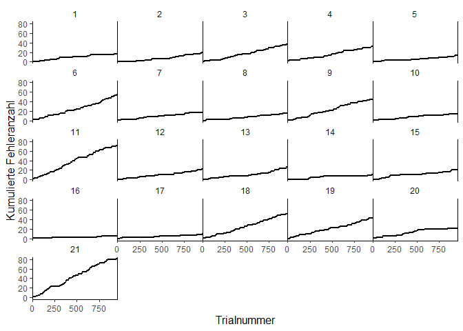<!-- -->

### lvl 2:

compute mean accumulated error per trial number, visualize

``` r
err_dat.lv2 <- err_dat.lv1 %>%
  group_by(trlNr) %>% 
  summarise(mean_acumErr = mean(acumErr))
err_plot.lv2 <- ggplot(err_dat.lv2, aes(x = trlNr, y = mean_acumErr)) +
  geom_point(shape = 1) +
  theme_classic() +
  xlab("Trialnummer") +
  ylab("Kumulierte Fehleranzahl")
err_plot.lv2
```

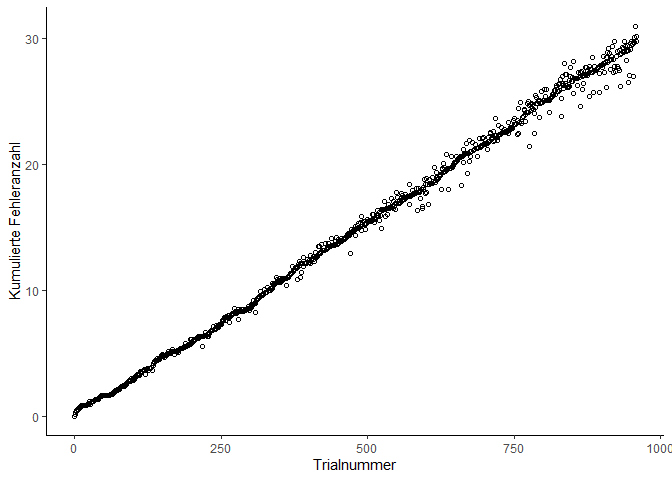<!-- -->

``` r
# impression: linear relationship, so no increase of error rate with trial number is perceived
```

## Sliding Windows (sl)

### Calculate Sliding windows for mean, sd and coefficient of variation

Esterman et al. (2013) used a 2-minute sliding window. In this
experiment, one trial had an approximate duration of 2750 ms. A window
of exact 2 minutes would take 43.6 trials. A window of 40 trials was
chosen. The first window was centered in the 0-2-minute window (–\>
start after the first 20 trials).

Calculate sliding windows for:
<ul>
<li>
$$mean(rt)$$
<li>
coefficient of variation (CoV: $$\frac{SD(x)}{mean(x)}$$) of RT
<li>
$$mean(error)$$
<li>

$$CoV(error)$$

``` r
cov <- function(x){
  sd(x) / mean(x)
}

sliding_window <- function(variable, FUN){
  rollapply(variable,
            width=41,
            FUN=FUN,
            fill=NA,
            align='center',
            partial=FALSE)
}

sliding_data <- data_cleaned %>% 
  group_by(id) %>% 
  mutate(err=case_when(key_resp_trial.corr == 10 ~ 1,
                       TRUE ~ 0)) %>% 
  mutate(sliding_mean_rt=sliding_window(key_resp_trial.rt, mean),
         sliding_cov_rt=sliding_window(key_resp_trial.rt, cov),
         sliding_mean_er=sliding_window(err, mean),
         sliding_cov_er=sliding_window(err, cov)
  )
```

### Plot Sliding windows

First, per person.

``` r
sliding_plot <- function(yaxis, ytitle){
  p <- ggplot(data=sliding_data, aes(x=trials.thisN, y={{yaxis}}))
  p +
    geom_line() + 
    facet_wrap(~id) +
    theme_classic() +
    xlab("Trialnummer") +
    ylab(ytitle) +
    theme(legend.position = "none",
          panel.background = element_rect(colour="black", fill="white"),
          strip.background = element_rect(colour="white", fill="white"),
          axis.title = element_text(size = 12),
          panel.spacing.x = unit(0,"line"), 
          panel.spacing.y = unit(0,"line")
    )
  }

sliding_plot_rt <- sliding_plot(sliding_mean_rt*1000, "Mittlere Reaktionszeit (ms)")
sliding_plot_rt_cov <- sliding_plot(sliding_cov_rt*1000, "CoV Reaktionszeit (ms)")
sliding_plot_error <- sliding_plot(sliding_mean_er, "Mittlere Fehleranzahl")
sliding_plot_error_cov <- sliding_plot(sliding_cov_er, "CoV Fehleranzahl")
  

sliding_plot_rt
```

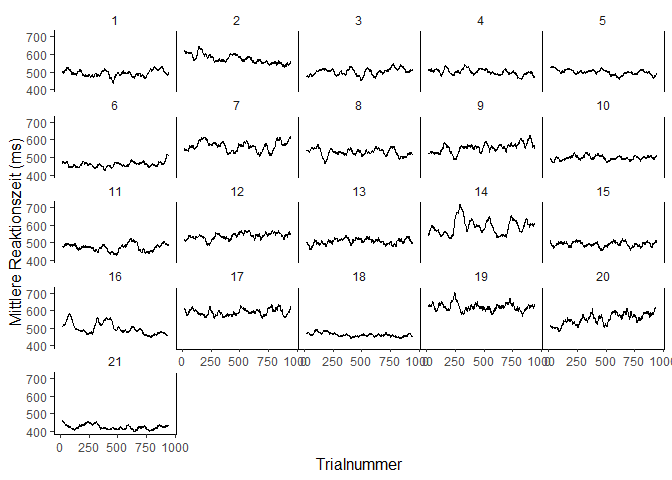<!-- -->

``` r
sliding_plot_rt_cov
```

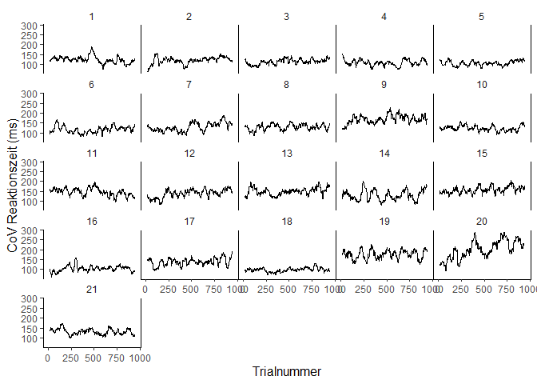<!-- -->

``` r
sliding_plot_error
```

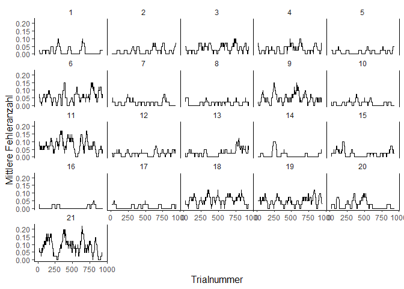<!-- -->

``` r
sliding_plot_error_cov
```

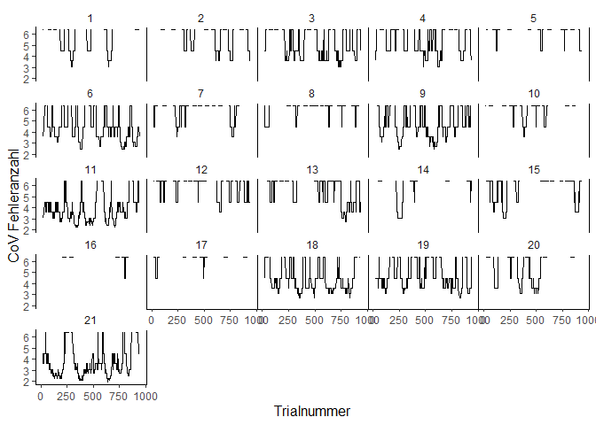<!-- -->

Then, with mean data:

``` r
sliding_data_all <- sliding_data %>% 
  group_by(id) %>% 
  summarise(trlNr = trials.thisN,
            sliding_mean_rt,
            sliding_cov_rt,
            sliding_mean_er,
            sliding_cov_er
            )
sliding_data_all <- sliding_data_all %>%
  group_by(trlNr) %>% 
  summarise(rtm.sl = mean(sliding_mean_rt),
            rtcov.sl = mean(sliding_cov_rt),
            erm.sl = mean(sliding_mean_er),
            ercov.sl = mean(sliding_cov_er)
  )


sliding_plot_grouped <- function(yaxis, ytitle){
  p <- ggplot(sliding_data_all, aes(x=trlNr, y={{yaxis}}))
  p + geom_point(shape = 1) +
  geom_smooth(method = "lm", colour = "black", size = 0.2) +
  theme_classic() +
  xlab("Zeit (min)") +
  ylab(ytitle) +
  scale_x_continuous(breaks = c(0, 218, 436, 654, 872),
                     labels = c(0, 10, 20, 30, 40))
}

slid_plot_grouped_rtmean <- sliding_plot_grouped(rtm.sl, "Mittlere Reaktionszeit (ms)")
slid_plot_grouped_rtcov <- sliding_plot_grouped(rtcov.sl, "CoV der Reaktionszeit (ms)")
slid_plot_grouped_errmean <- sliding_plot_grouped(erm.sl, "Mittlere Fehleranzahl")

slid_plot_grouped_rtmean
```

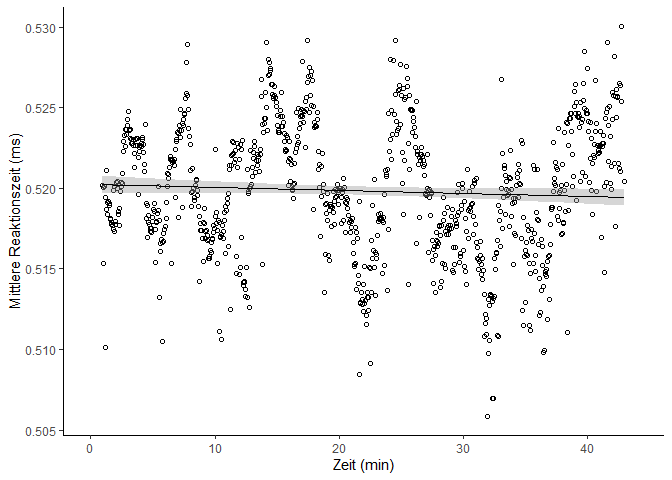<!-- -->

``` r
slid_plot_grouped_rtcov
```

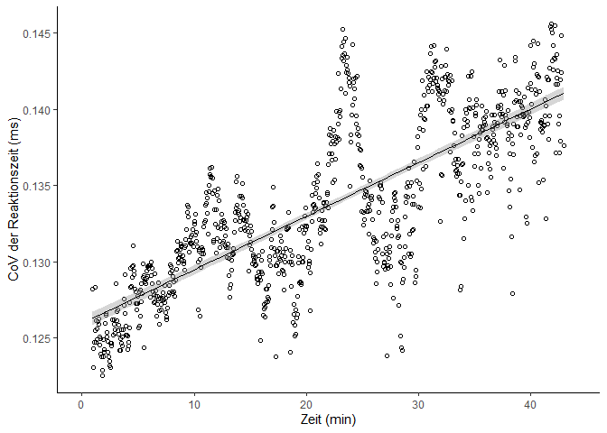<!-- -->

``` r
slid_plot_grouped_errmean
```

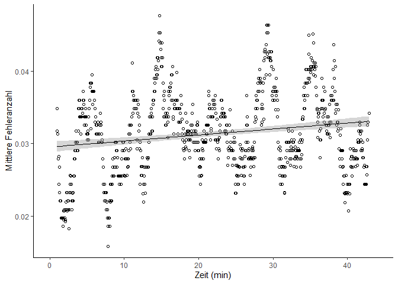<!-- -->

### Slope testing

Correspondent to Esterman et al. (2013), linear slopes were calculated
per person and then the slopes were tested for statistical difference
from zero.

Here, four linear models were computed (for mean RT, CoV RT, mean error
and CoV error respectively) and then the slope, value of the test
statistic and <i>p</i>-value were handed out in the variable
<i>slope_parameters</i>.

Lastly, the slopes were tested for statistical difference from zero
(one-sample <i>t</i>-Test):

``` r
slope_parameters <- sliding_data %>% 
  group_by(id) %>% 
  do(mod1 = lm(sliding_mean_rt ~ trials.thisN, data = .), # computing models
     mod2 = lm(sliding_cov_rt ~ trials.thisN, data = .),
     mod3 = lm(sliding_mean_er ~ trials.thisN, data = .),
     mod4 = lm(sliding_cov_er ~ trials.thisN, data = .)
     ) %>% 
  summarise(slope_m.rt = summary(mod1)$coefficients[2,1], # handing out parameters
            t_m.rt = summary(mod1)$coefficients[2,3],
            p_m.rt = summary(mod1)$coefficients[2,4],
            slope_cov.rt = summary(mod2)$coefficients[2,1],
            t_cov.rt = summary(mod2)$coefficients[2,3],
            p_cov.rt = summary(mod2)$coefficients[2,4],
            slope_m.err = summary(mod3)$coefficients[2,1],
            t_m.err = summary(mod3)$coefficients[2,3],
            p_m.err = summary(mod3)$coefficients[2,4],
            slope_cov.err = summary(mod4)$coefficients[2,1],
            t_cov.err = summary(mod4)$coefficients[2,3],
            p_cov.err = summary(mod4)$coefficients[2,4]
            )
slope_tests <- slope_parameters %>% 
  ungroup() %>% 
  summarise(m.rt_t = t.test(slope_m.rt, mu = 0)$statistic,
            m.rt_p = t.test(slope_m.rt, mu = 0)$p.value,
            cov.rt_t = t.test(slope_cov.rt, mu = 0)$statistic,
            cov.rt_p = t.test(slope_cov.rt, mu = 0)$p.value,
            m.err_t = t.test(slope_m.err, mu = 0)$statistic,
            m.err_p = t.test(slope_m.err, mu = 0)$p.value,
            cov.err_t = t.test(slope_cov.err, mu = 0)$statistic,
            cov.err_p = t.test(slope_cov.err, mu = 0)$p.value
            )
slope_tests
```

    ## # A tibble: 1 × 8
    ##    m.rt_t m.rt_p cov.rt_t cov.rt_p m.err_t m.err_p cov.err_t cov.err_p
    ##     <dbl>  <dbl>    <dbl>    <dbl>   <dbl>   <dbl>     <dbl>     <dbl>
    ## 1 0.00370  0.997     2.52   0.0204   0.820   0.422    -0.787     0.440

During the slope testing only outcome of the slope of the covariation
coefficient of the reaction time was statistically significant.

### Source for Sliding Window and Slope testing

Esterman, M., Noonan, S. K., Rosenberg, M. & Degutis, J. (2013). In the
zone or zoning out? Tracking behavioral and neural fluctuations during
sustained attention. Cerebral Cortex (New York, N.Y. : 1991), 23(11),
2712–2723. <https://doi.org/10.1093/cercor/bhs261>
